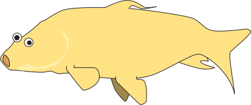

<<<<<<< HEAD
<p align=center></p>
<h3 align=center>c o l o c a r p y</h3>
=======
<p align=center></p>
<h3 align=center>neuvue-client</h3>
>>>>>>> dfa74bb85eb591cb40fac6dc5fff170191e1f538
<h6 align=center>a python client for neuvuequeue</h6>

# Installation

```shell
<<<<<<< HEAD
pip3 install git+https://github.com/aplbrain/neuvueclient.git
=======
pip3 install git+https://github.com/aplbrain/neuvue-client.git
>>>>>>> dfa74bb85eb591cb40fac6dc5fff170191e1f538
```

# Configuration

<<<<<<< HEAD
Create a configuration file in your home directory `~/.neuvueclient/.neuvueclient` with your bossdb username and password:
=======
Create a configuration file in your home directory `~/.neuvueclient/neuvue-secret.txt` with your Google Oauth token:
>>>>>>> dfa74bb85eb591cb40fac6dc5fff170191e1f538

```
[CONFIG]
token = <insert token>
```

# Usage

First, create a new neuvuequeue instance:

```python
import neuvueclient as Client

C = Client.NeuvueQueue("http://neuvuequeue-server/")
```

Now you can do all that your corazón desires:

```python
C.get_tasks(sieve={"namespace": "split"})
```

# Implementation Progress

| Object   | POST | GET | LIST | DELETE | PATCH |
|----------|------|-----|------|--------|-------|
| Point    | ✅ | ✅ | ✅ | ✅ | ⛔ 
| Task     | ✅ | ✅ | ✅ | ✅ | ✅
